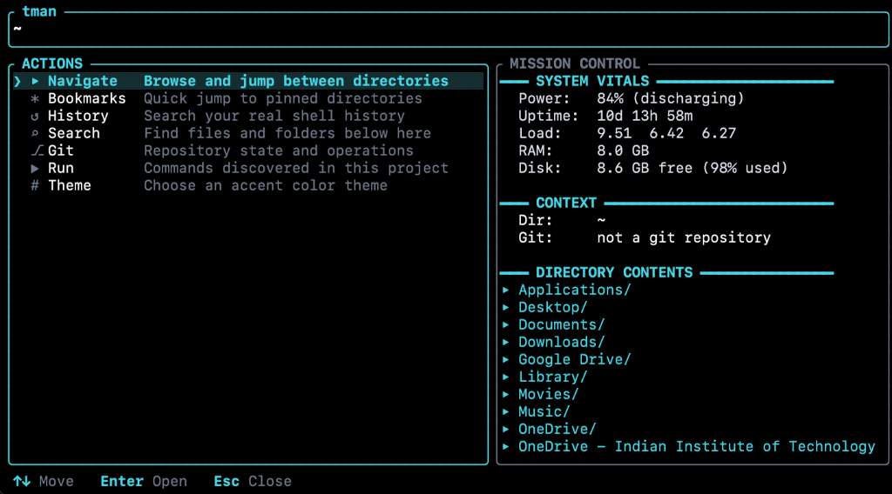

<div align="center">

# tman

**A context-aware interactive layer over your terminal.**

[](https://www.rust-lang.org/)
[](LICENSE)
[](https://github.com/IamShreshth/Tman)
[](https://github.com/IamShreshth/Tman)
[](docs/requirements.txt)

<br/>



</div>

`tman` drops an interactive HUD directly over your shell prompt with `Ctrl+Shift+T` (or `Ctrl+Space`), enabling directory navigation, project workflow execution, history search, and system telemetry without interrupting your active workflow.

---

## Quick Start

### 1. Install
```bash
curl -fsSL https://raw.githubusercontent.com/IamShreshth/Tman/main/files/install.sh | bash
```

### 2. Activate
```bash
source ~/.zshrc   # If using Zsh
# OR
source ~/.bashrc  # If using Bash
```

### 3. Launch
Press `Ctrl+Shift+T` (or `Ctrl+Space`) anywhere in your shell, or run `tman`.

---

## Capabilities

- **Zero-Daemon HUD**: Ephemeral full-screen overlay that takes ownership of the terminal buffer and releases it cleanly on exit.
- **System Telemetry**: Real-time inspection of battery status, CPU load averages, memory allocation, volume capacity, and active Git branch state.
- **Workflow Discovery**: Automatically senses repository types (Rust, Python, Node, Go, Docker, Make) and compiles actionable targets.
- **Navigation & Bookmarks**: Fast directory traversal with persistent directory pinning and in-prompt `cd` integration.

---

## Keybindings

| Key | Context | Action |
| :--- | :--- | :--- |
| `Ctrl+Shift+T` / `Ctrl+Space` | Shell | Toggle HUD overlay |
| `Up` / `Down` or `j` / `k` | Navigation | Move cursor selection |
| `Enter` | Any View | Execute selected action / `cd` into folder |
| `Right` / `l` | File Browser | Open highlighted directory |
| `Left` / `h` / `Backspace` | Submenus | Navigate to parent directory / previous view |
| `b` | Menu / Files | Bookmark current directory or highlighted folder |
| `d` or `x` | Bookmarks | Delete highlighted bookmark |
| `Tab` | Browser / Runners | Open action menu / insert command into shell |
| `/` | Lists | Filter items with fuzzy search |
| `.` | File Browser | Toggle hidden dotfiles |
| `m` | Submenus | Return to main menu |
| `Esc` | Any View | Clear search / close modal / exit HUD |
| `Ctrl+C` / `Ctrl+D` | Any View | Terminate overlay |

---

## Requirements

`tman` is written in Rust and compiles to a standalone, zero-dependency native binary. No external runtimes (Python, Node.js) are needed.

| Component | Requirement |
| :--- | :--- |
| **Operating System** | macOS (Apple Silicon & Intel) or Linux (x86_64, aarch64) |
| **Supported Shells** | Zsh (v5.0+) or Bash (v4.0+) |
| **Build Toolchain** | Rust 1.70+ and Cargo (only when building from source) |

See [docs/requirements.txt](docs/requirements.txt) for technical specifications.

---

## Alternative Installation

### Install via Cargo
```bash
cargo install --git https://github.com/IamShreshth/Tman.git --locked
echo 'eval "$(tman init zsh)"' >> ~/.zshrc
```

### Build from Source
```bash
git clone https://github.com/IamShreshth/Tman.git
cd Tman
./files/install.sh
```

---

## Uninstallation

```bash
rm -f ~/.local/bin/tman ~/.cargo/bin/tman
rm -rf ~/.config/tman
```

Remove the `eval "$(tman init ...)"` line from your `~/.zshrc` or `~/.bashrc`.

---

## License

Licensed under the [MIT License](LICENSE).
